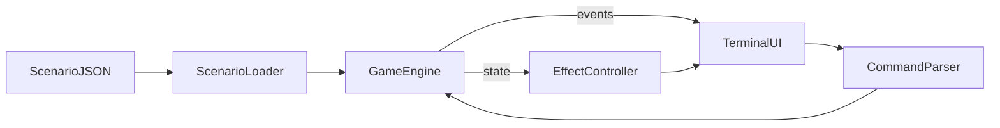

# Архитектура The Isolation Layer

## Принятые решения

| Решение | Выбор | Обоснование |
|---------|-------|-------------|
| Стек | Vite + Vanilla TypeScript | Лёгкий runtime, прямой DOM-рендеринг терминала без фреймворка |
| Формат сценариев | Модульный JSON | `resolveJsonModule` в tsconfig; разделение данных по файлам |
| Язык UI | Русский | Соответствует геймдизайн-докам |
| Цветовая тема | `#00FF66` (фосфор) | По умолчанию; янтарный через CSS `--crt-color: #FFB300` |
| Шрифт | JetBrains Mono | Monospace для CRT-эстетики |
| Звук | Интерфейс `AudioManager` (заглушка) | Howler.js — в roadmap readme |
| Разделение слоёв | Engine не знает о DOM | UI подписывается на события движка |

## Структура проекта

```
src/
  main.ts                 — bootstrap
  engine/                 — FSM, состояние, загрузка сценариев
  cli/                    — парсер и реестр команд
  ui/                     — TerminalUI + 4 зоны + эффекты
  scenarios/demo/         — демо-сценарий (3 смены), JSON-модули
public/
  scenarios/demo/         — runtime-путь для fetch (dev + production)
  styles/                 — CRT, layout, effects CSS
doc/
  architecture.md         — этот файл
  scenario-format.md      — спека JSON-сценариев
```

## Поток данных



### События движка (EngineEvent)

- `stateChanged` — обновление метрик, лога, флагов
- `ticketPresented` — новый тикет на экране
- `ticketResolved` — выбор сделан
- `shiftChanged` — переход на следующую смену
- `effectTriggered` — одноразовый эффект (ai_cli_override)
- `gameEnded` — финал или game over

## GameEngine (FSM)

1. **LoadScenario** — ScenarioLoader собирает модули, validators проверяет граф
2. **PresentTicket** — показ тикета, onEnter side-effects
3. **AwaitInput** — кнопки или CLI
4. **ResolveChoice / ResolveCLI** — применение impact
5. **CheckMetrics** — clamp, game over при 0
6. **CheckEnding** — при завершении смены или всех смен

### Метрики

- `energy`: 0–100, game over при 0
- `aiStability`: 0–100, game over при 0 (финал «Автономный полёт»)
- `colonists`: 0–50000, game over при 0

### Смены

Тикеты группируются по полю `shift`. Переход на N+1 когда текущая ветка завершена (`nextTicket: null`) и нет следующего тикета в очереди смены — движок берёт `shift-end` или следующий по порядку тикет смены.

## EffectController

Читает `GameState` и выставляет CSS-классы на `document.documentElement`:

| Порог | Класс |
|-------|-------|
| aiStability < 50 | `effect-corruption` |
| aiStability < 30 | `effect-panic` |
| energy < 20 | `effect-blackout` |

Одноразовые эффекты из `onEnter.triggerEffect` эмитятся через `effectTriggered`.

## CLI

Встроенные команды: `HELP`, `SYS_STATUS`, `SEARCH`, `CLEAR`.

`SYS_STATUS` и просмотр вкладки F2 DIAGNOSTICS выставляют `verifiedDiagnostics = true` — нужно для опций с `requiresVerification`.

## Расширяемость

- Новые сценарии: папка в `public/scenarios/<id>/` + `index.json` (authoring-копия может храниться рядом в репозитории)
- Новые CLI-команды: массив в `cli.json` сценария
- Звук: реализовать методы `AudioManager` и подключить Howler.js
